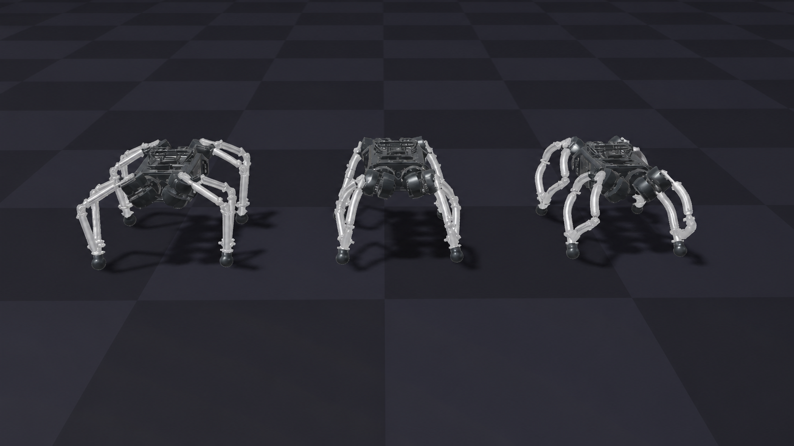

# AsOverDog on Newton

[](https://www.python.org/)
[](https://github.com/newton-physics/newton/releases/tag/v1.5.1)
[](LICENSE)

This repository is a compact [Newton/Kamino](https://github.com/newton-physics/newton) demo for asOverDog with Bennett, Planar, and Spherical legs.



## Setup

Install [`uv`](https://docs.astral.sh/uv/getting-started/installation/) and create the environment:

```bash
uv sync
```

## Run

```bash
uv run play.py --robot bennett
uv run play.py --robot planar
uv run play.py --robot spherical
```

### Viewer controls

| Keys      | Action             |
| --------- | ------------------ |
| `I` / `K` | Forward / backward |
| `J` / `L` | Left / right       |
| `U` / `O` | Turn left / right  |
| `P`       | Reset              |

### Useful options

Run a fixed command without the viewer:

```bash
uv run play.py --robot bennett --headless --steps 200 --vx 0.5
```

Set fallback velocity commands for the viewer:

```bash
uv run play.py --robot planar --vx 0.5 --vy 0.0 --yaw-rate 0.0
```

Run the simulator with zero actions:

```bash
uv run play.py --robot spherical --zero-action
```

See all options with `uv run play.py --help`.

## Models

Each robot pairs a USD mechanism with a robot-specific ONNX gait policy. All three policies use
the same control interface and share one learned actuator model.

| Robot     | USD                              | Gait policy                         |
| --------- | -------------------------------- | ----------------------------------- |
| Bennett   | `assets/robots/bennett.usdc`     | `assets/policies/bennett.onnx`      |
| Planar    | `assets/robots/planar.usdc`      | `assets/policies/planar.onnx`       |
| Spherical | `assets/robots/spherical.usdc`   | `assets/policies/spherical.onnx`    |

At 50 Hz, each gait policy receives `obs` with 25 frames of 61 features (`1 × 1525`) and produces
12 normalized motor-position offsets through `actions` (`1 × 12`). The shared actuator model uses
joint position-error and velocity history to convert those targets into motor torques at each
simulation step. On CUDA, the policy, actuator, and eight 400 Hz Kamino physics steps remain on the
device and replay as one policy-period CUDA Graph. Viewer updates are paced to the same 50 Hz rate;
headless runs remain unthrottled.

Robot assets and simulation parameters are defined in
[`assets/robots/robots.json`](assets/robots/robots.json). Policy paths, observation fields, tensor
contracts, and hashes are defined in
[`assets/policies/policies.json`](assets/policies/policies.json).

## License

Licensed under the [Apache License 2.0](LICENSE).
